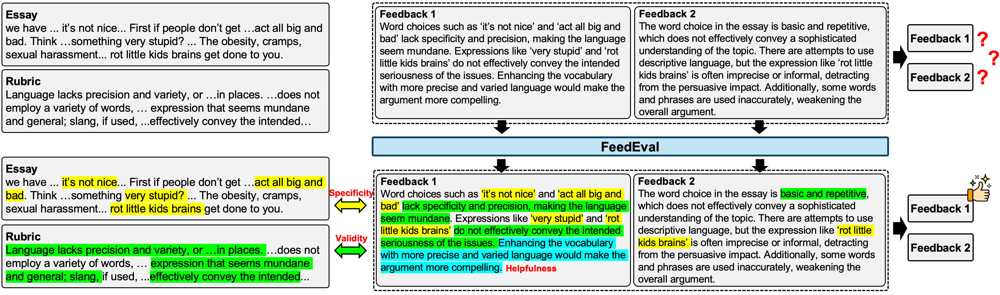
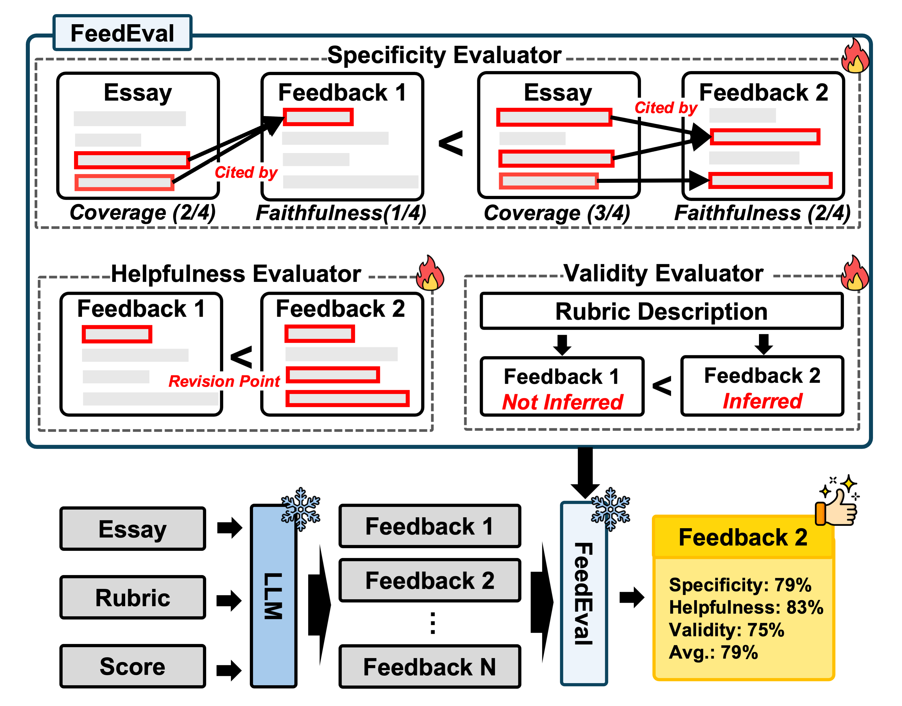

# FeedEval 🤖


[](https://opensource.org/licenses/MIT)
[](https://docs.python.org/3/license.html)
[-green)](https://paperswithcode.com/dataset/asap)
[-red)](https://www.kaggle.com/competitions/asap-sas)


## 📖 Overview

Going beyond the prediction of numerical scores, recent research in automated essay scoring has increasingly emphasized the generation of high-quality feedback that provides justification and actionable guidance. To mitigate the high cost of expert annotation, prior work has commonly relied on LLM-generated feedback to train essay assessment models. However, such feedback is often incorporated without explicit quality validation, resulting in the propagation of noise in downstream applications. To address this limitation, we propose FeedEval, an LLM-based framework for evaluating LLM-generated essay feedback along three pedagogically grounded dimensions: specificity, helpfulness, and validity. FeedEval employs dimension-specialized LLM evaluators trained on datasets curated in this study to assess multiple feedback candidates and select high-quality feedback for downstream use. Experiments on the ASAP++ benchmark show that FeedEval closely aligns with human expert judgments and that essay scoring models trained with FeedEval-filtered high-quality feedback achieve superior scoring performance. Furthermore, revision experiments using small LLMs show that the high-quality feedback identified by FeedEval leads to more effective essay revisions.

📑 Paper
**FeedEval: Pedagogically Aligned Evaluation of LLM-Generated Essay Feedback**  
*Seongyeub Chu, Jongwoo Kim, Munyong Yi*  
Annual Meeting of the Association for Computational Linguistics (ACL-Findings '26). [`arXiv`](https://arxiv.org/abs/2601.04574)

## ⭐ Overview of FeedEval

- FeedEval consists of three evaluators, each trained on a dataset corresponding to a specific evaluation dimension. Given multiple feedback candidates generated by an LLM, FeedEval evaluates their quality along three dimensions and selects the highest-quality feedback.



## 💻 Getting Started


### Intallation
<pre>
pip install -r requirements.txt
</pre>

### How to Train Evaluator (ex: Specificity)
<pre>
accelerate launch specificity_evaluator.py --batch_size 4 --epochs 5 --model_name meta-llama/Llama-3.2-3B-Instruct
</pre>

### How to Generate Feedback (Generator: GPT-5.1)
<pre>
python gpt_feedback_generation.py
</pre>

### How to Train Essay Evaluator (Evaluator: Qwen3-8B / Output: Score + Feedback)
<pre>
accelerate launch sft_essay_evaluation.py --model_name Qwen/Qwen3-8B --train_batch_size 4 --eval_batch_size 4 --test_batch_size  16 --epochs 5 --eval_steps 100 --learning_rate 1e-4 --patience 2
</pre>

### How to Train Essay Scoring (Evaluator: Qwen3-8B / Output: Score)
<pre>
accelerate launch sft_essay_scoring.py --model_name Qwen/Qwen3-8B --train_batch_size 4 --eval_batch_size 4 --test_batch_size  16 --epochs 5 --eval_steps 100 --learning_rate 1e-4 --patience 2
</pre>

### How to Run Essay Reviser (Reviser: Qwen2-1B-Instruct, Quality: High)
<pre>
python essay_reviser.py --batch_size 8 --llm qwen --quality high
</pre>

## 🛢️ Google Drive Data
**Link**: https://drive.google.com/drive/folders/1yK7us2hKaYHDwjx7xK_yJQxP-X1roYDN?usp=sharing
- feedback_preference_dataset.json
- speceval_dataset.json
- validity_dataset.csv

## 🔧 Stack
- **Language**: Python
- **Utilized LLMs**: GPT-5.1, Llama3-8B-Instruct, Qwen3-8B, Llama3-1B-Instruct, Qwen3-1B-Instruct
- **Dependencies** : Refer to "requirements.txt"
- **Dataset** : ASAP & ASAP-SAS


## Project Structure

<!-- ```markdown -->
<pre>
FeedEval
├──assets
├──data
│   ├── fold_0
│   ├── fold_1
│   ├── fold_2
│   ├── fold_3
│   ├── fold_4
│   ├── rubric
│   ├── entire_data.csv
│   ├── feedback_preference_dataset.json
│   ├── speceval_dataset.json
│   ├── validity_dataset.csv
│   └── filtered_low_score_data
├──srcs
│   ├──essay_reviser.py
│   ├──gpt_feedback_generation.py
│   ├──gpt_model.py
│   ├──specificity_evaluator.py
│   ├──helpfulness_evaluator.py
│   ├──validity_evaluator.py
│   ├──sft_essay_evaluation.py
│   ├──sft_essay_scoring.py
│   └──evaluation.py
└──requirements.txt
</pre>


